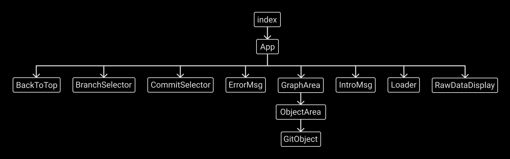

# Contributing to Git Graph

-   Please check the [issues tab](https://github.com/HarshKapadia2/git-graph/issues) for things to work on.
-   Please [raise an issue](https://github.com/HarshKapadia2/git-graph/issues) to request a feature/modification or for reporting a bug, if it has not already been raised.

## Tech Stack

-   React.js ([Create React App](https://create-react-app.dev))

## Gitpod Setup

[](https://gitpod.io/#https://github.com/HarshKapadia2/git-graph)

-   On clicking on the above 'Open in Gitpod' button, a Gitpod Workspace with all dependencies installed and the development server started will open up.
-   Make sure to do a GitHub integration and grant permissions on the [Integrations page](https://gitpod.io/integrations) on Gitpod if not already done.
-   [Make a new Git branch](https://harshkapadia2.github.io/git_basics/#_branch_name_2) on Gitpod and [switch to the newly created branch](https://harshkapadia2.github.io/git_basics/#_git_switch).
-   The development server should already be started, but in case it isn't, run `npm run start` in the root directory of the project to start it.
    -   Run `npm run build` to generate a production build in the `build` directory to test it out. Do not commit this directory.
-   Make the required contribution(s) on Gitpod in the new branch.
    -   Please follow the [commit message format](https://harshkapadia2.github.io/git_basics/#_commit_messagetitle).
-   To open a PR
    -   Fork this repo. (Top right corner on GitHub.)
    -   On Gitpod, [add the forked repo as a remote](https://harshkapadia2.github.io/git_basics/#_add_connecting_repo_alias_connecting_repo_url_git).
    -   [Push the new branch to the forked repo.](https://harshkapadia2.github.io/git_basics/#_git_push)
    -   [Open a PR as usual](https://github.com/firstcontributions/first-contributions#submit-your-changes-for-review) from the forked repo on GitHub.

## Local Setup

-   Fork this repo. (Top right corner.)
-   Clone the forked repo using the [`git clone` command](https://harshkapadia2.github.io/git_basics/#_git_clone).
-   `cd` into the cloned repo directory.
-   Execute `npm install` in the root directory of the project to install all dependencies.
-   Execute `npm run start` in the root directory of the project to start the development server.
    -   Run `npm run build` to generate a production build in the `build` directory to test it out. Do not commit this directory.
-   Make contribution(s).
-   Write meaningful commit messages and include the number (#) of the issue being resolved (if any) at the end of the commit message.

    Example: `:bug: fix: Resolve 'isCorrect' function error (#0)`

    [Commit message format](https://harshkapadia2.github.io/git_basics/#_commit_messagetitle)

-   Open a Pull Request (PR).
    -   [Learn how to open a PR.](https://github.com/firstcontributions/first-contributions)
    -   Solve one issue per PR, without any extra changes.
    -   Include extra changes in a separate PR.

## Component Structure



## `objectData` Structure

```json
{
    "objects": {
        "commits": [
            {
                "hash": "<string>",
                "name": "<commit_msg>|''",
				"color": <boolean>
            },
            ...
        ],
        "trees": [
            {
                "hash": "<string>",
                "name": "<directory_name>|''",
				"color": <boolean>
            },
            ...
        ],
        "blobs": [
            {
                "hash": "<string>",
                "name": "<file_name>",
				"color": <boolean>
            },
            ...
        ]
    },
    "objectConnections": [
        {
            "start": "<hash|'head'>",
            "end": "<hash|formatted_file_name|''>",
			"color": <boolean>
        },
        ...
    ]
}
```

## `rawObjects` Structure

```json
{
	"objects": [
		{
			"commit": "<hash>",
			"commitMsg": "<commit_msg>|''",
			"parentCommit": "<hash>|''",
			"tree": "<hash>",
			"blobs": [
				{
					"type": "blob|tree",
					"name": "<file_name>|<directory_name>",
					"hash": "<string>"
				},
				...
			]
		},
		...
	],
	"recursiveTrees": {
		"<hash>": [
			{
				"type": "blob|tree",
				"name": "<file_name>|<directory_name>",
				"hash": "<string>"
			},
			...
		],
		...
	}
}
```

## Further Help

If any further help is needed, do not hesitate to contact the author ([Harsh Kapadia](https://harshkapadia.me)) via Twitter [@harshgkapadia](https://twitter.com/harshgkapadia), [LinkedIn](https://www.linkedin.com/in/harshgkapadia) or e-mail ([contact@harshkapadia.me](mailto:contact@harshkapadia.me)). An [issue](https://github.com/HarshKapadia2/git-graph/issues) can be raised as well.
