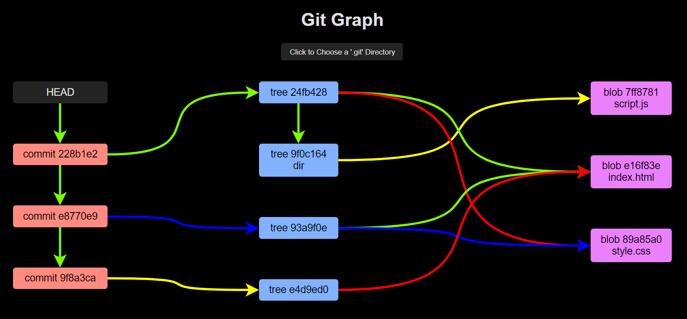

# Git Graph

Visualize the Directed Acyclic Graph that Git creates to connect Commit, Tree and Blob objects.

Hosted at [HarshKapadia2.github.io/git-graph](https://harshkapadia2.github.io/git-graph).

> NOTE:
>
> -   Learn about [Git Objects](https://harshkapadia2.github.io/git_basics/#_git_objects).
> -   This web app is a part of [my Git Internals talks](https://talks.harshkapadia.me/git_internals).
> -   This project cannot handle all Git repos.
> -   The code quality is not that great as a LOT of progress has yet to be made in terms of handling different Git repo scenarios.
> -   Special thanks to [@KartikSoneji](https://github.com/KartikSoneji) for his help with some critical things.
