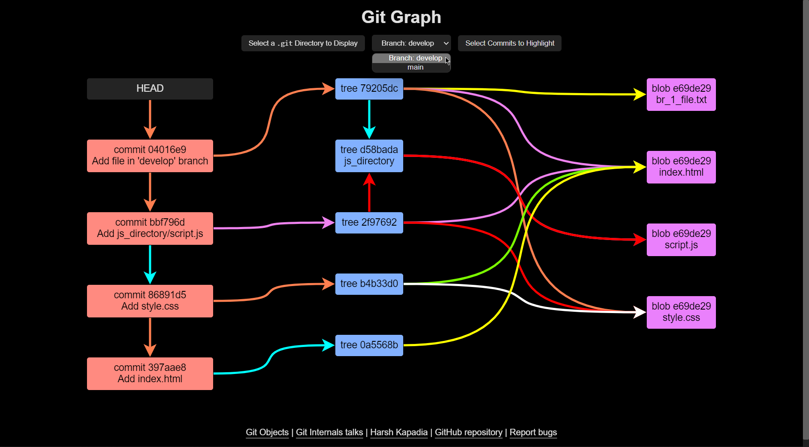
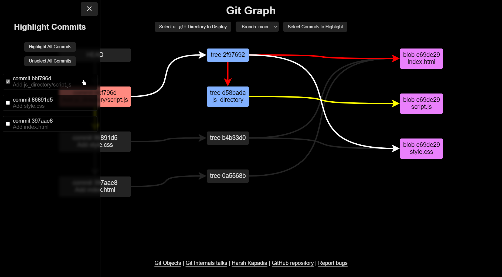
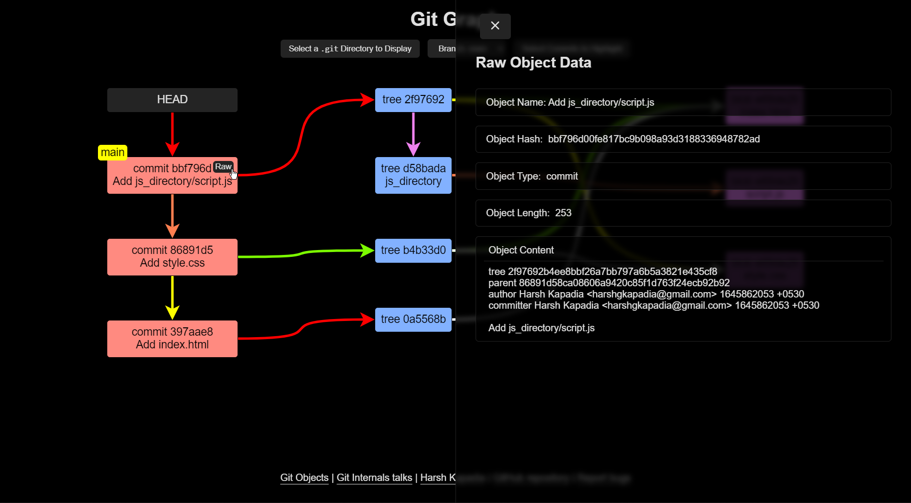

# Git Graph

Visualize the Directed Acyclic Graph that Git creates to connect Commit, Tree and Blob objects internally.

Hosted at [HarshKapadia2.github.io/git-graph](https://harshkapadia2.github.io/git-graph).

> NOTE:
>
> -   [Learn about Git Objects.](https://git.harshkapadia.me/#_git_objects)
> -   This web app is a part of [my Git Internals talks](https://talks.harshkapadia.me/git_internals).
> -   Special thanks to [@KartikSoneji](https://github.com/KartikSoneji) for his help with parsing Tree files and [@tusharnankani](https://github.com/tusharnankani) for his UI/UX suggestions.
> -   Please report errors and bugs by [raising issues](https://github.com/HarshKapadia2/git-graph/issues).

## Usage

-   Select the `.git` directory of a repository for the graph to render.
    -   If the `.git` directory is not visible in the directory picker, please enable hidden file viewing on the local machine.
    -   Extremely huge repositories might not load due to browser memory constraints.
    -   'Packed repo' error: Please unpack **all** the [packfiles](https://git.harshkapadia.me/#_the_pack_directory) (`.pack` files) in the repository. ([Tutorial](https://www.youtube.com/watch?v=cauIy20JhFs))
-   Using the Branch Selector, any local branch can be visualized.
    -   'No branch' error: No branches could be found. Either the directory uploaded is not a `.git` directory or the repository has no commits in the checked out branch.
-   Using the Commit Selector, one or more Commits and their corresponding Trees and Blobs can be highlighted.
-   Hover over objects and click on the 'Raw' button to view the raw contents of that Git Object.

## Screenshots

Select the branch to render 👇

Select commit(s) to highlight 👇

View the raw contents of any Git Object 👇

## Contribution

Contributors are most welcome! Please go through the [`CONTRIBUTING.md` file](CONTRIBUTING.md) for local project setup instructions and the component and object structures.

 

	The Git logo by <a href="https://twitter.com/jasonlong">Jason Long</a> is licensed under the <a href="https://creativecommons.org/licenses/by/3.0/legalcode">Creative Commons Attribution 3.0 Unported License</a>.

